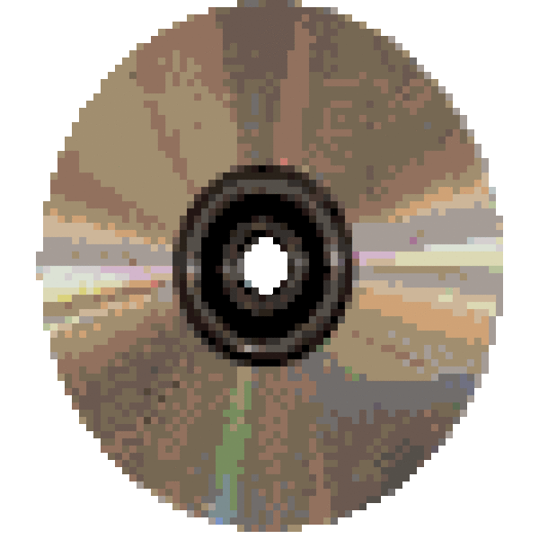

<strong>📀 That One Dutch Guy's DVD-R ISO Hangar 📀</strong>

  
   
  

<strong>WELCOME TO MY DVD-R ISO HANGAR!</strong>

<strong>This shitty website is basically an altered version of the Shit Ass Toybox! 🤯</strong>

<strong>Except THIS is a old YTP preservation project site! 😎</strong>

<strong>It uses the same eye-bleedingly fabulous design in fact! ☢️</strong>

<strong>All the ISO files are hosted on fucking Mega! 🌐</strong>

<strong>These are meant to burn onto blank DVD-R dics to preserve the old YTPs! 📀</strong>

---

<strong>Currently available ISO's:</strong>

<strong>YTP Classics CD-i - featuring 17 classic YTP videos centered around the Nintendo licensed CD-i Zelda games and Hotel Mario!</strong>

---

<strong>How to download the ISO files:</strong>

<strong>Aight! I'll show ya how! I promise I won't be a boring instructor!</strong>

---

<ul>
<li><strong>Step 1: Click the fucking fabulous rainbow download button and you'll be taken to Mega's website! 👀</strong></li>
<li><strong>Step 2: Download the ISO of your good choice and pray that you don't have shitty internet! 🖥️🔌🌐</strong></li>
<li><strong>DONE!</strong></li>
</ul>

---

<strong>How to burn the ISO files to a DVD-R:</strong>

<ul>
<li><strong>Step 1: Get a fucking blank DVD-R disc! Buy 'em if you don't have any! 📀</strong></li>
<li><strong>Step 2: Have an internal or external drive that allows you to BURN the fuckers! 🔥</strong></li>
<li><strong>Step 3: Insert the DVD-R into your drive and hear it SPINNNN! 🌀</strong></li>
<li><strong>Step 4: Use your preferred disc burning application and start the fucking burning process! 😎</strong></li>
<li><strong>Step 5: Keep your dirty lil fingers off the drive while it's burning and wait! ⌚️</strong></li>
<li><strong>Step 6: Once it's done, YEET that bad boi into any DVD player and BINGE! 📺</strong></li>
</ul>

---